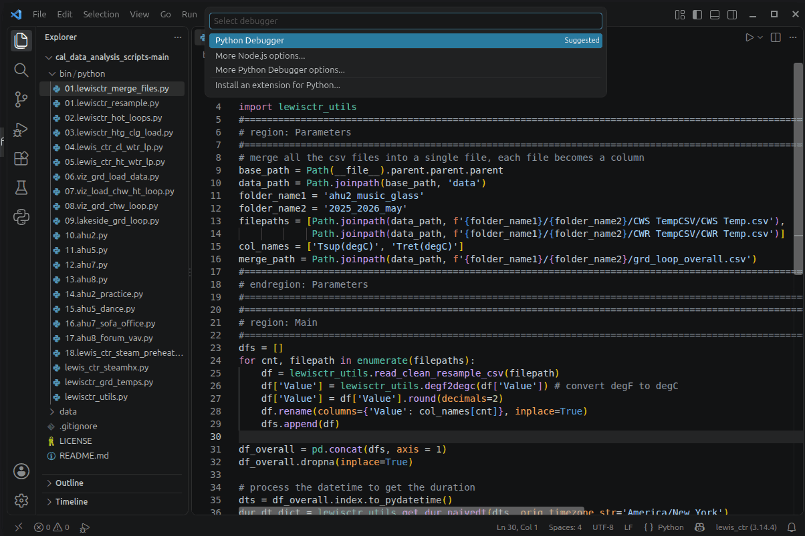

# Getting Started
It is assumed you are familiar with Python. If you do not have an IDE to execute the Python codes. VScode is the recommended IDE. Download it <a href="https://code.visualstudio.com/download?_exp_download=fb315fc982" target="_blank">here</a>. 
 
## Download the scripts and data folder
1. Download the codes from the repository. Go Code -> Download ZIP as shown in the image below. Once downloaded, extract the folder. It will be extracted as 'cal_data_analysis_scripts-main' folder.

    <p align="center">
    
    </p>

2. Now go to our google drive share folder and download the data zip file LCA_CaL/data/lewis_ctr_geodata_20260921.zip. Extract the file. Once extracted, there is a 'data' folder in the 'lewis_ctr_geodata_20260921' folder. 
    ```
    lewis_ctr_geodata_20260921
        |--- data
    ```
3. Cut and paste the 'data' folder into the 'cal_data_analysis_scripts-main' folder. Your 'cal_data_analysis_scripts-main' folder will have the following structure.
    ```
    cal_data_analysis_scripts-main
        |--- bin
            |--- python
        |--- data
        |--- LICENSE
        |--- README.md
    ```

## Create a Python virtual environment to run the script
- this will work for linux and mac computers. Windows computer commands are slightly different.

1. Create a virtual environment call 'lewis_ctr'.
    ```
    python3 -m venv ~/venv/lewis_ctr
    ```
2. Activate the virtual environment.
    ```
    source ~/venv/lewis_ctr/bin/activate
    ```
3. Install the various libraries require for running the scripts.
    ```
    pip install pytz pandas matplotlib geomie3d
    ```

## Run the scripts in VScode
1. Open VScode and go to File -> Open Folder ... select the 'cal_data_analysis_scripts-main' folder.
    
    <p align="center">
    
    </p>

2. Activate the virtual environment that we created in the previous section in the VScode. Using the shortcut key 'Ctrl + Shift + p' you can select the Python:Select Interpreter -> Enter interpreter path...-> Find... Select ~/venv/lewis_ctr/bin/python

    <p align="center">
    
    </p>

3. Select the '02.lewisctr_hot_loops.py'. Run the script by pressing 'F5'. Select Python Debugger -> Python File. 
    
    <p align="center">
    
    </p>

4. You should get the following results from the execution. You have successfully executed the script.
    ```
    ------------------------------------------------------------------------------------------------------------------------------------------------------------
    Min Tsup (degF): 70.10600000000001, Max Tsup (degF):87.8, Avg Tsup (degF): 76.55688556395293, Med Tsup (degF): 75.506
    Min Tsup (degC): 21.17, Max Tsup (degC):31.0, Avg Tsup (degC): 24.753825313307182, Med Tsup (degC): 24.17
    ------------------------------------------------------------------------------------------------------------------------------------------------------------
    Heating season
    ------------------------------------------------------------------------------------------------------------------------------------------------------------
    Min Tsup (degF): 70.10600000000001, Max Tsup (degF):80.096, Avg Tsup (degF): 73.36976277456647, Med Tsup (degF): 73.094
    Min Tsup (degC): 21.17, Max Tsup (degC):26.72, Avg Tsup (degC): 22.983201541425817, Med Tsup (degC): 22.83
    ------------------------------------------------------------------------------------------------------------------------------------------------------------
    Cooling season
    ------------------------------------------------------------------------------------------------------------------------------------------------------------
    Min Tsup (degF): 73.292, Max Tsup (degF):87.8, Avg Tsup (degF): 79.75593815304241, Med Tsup (degF): 80.006
    Min Tsup (degC): 22.94, Max Tsup (degC):31.0, Avg Tsup (degC): 26.531076751690225, Med Tsup (degC): 26.67
    ------------------------------------------------------------------------------------------------------------------------------------------------------------
    {'overall': {'max': np.float64(31.0), 'min': np.float64(21.17), 'avg': np.float64(24.753825313307182), 'med': np.float64(24.17)}, 'htg_season': {'max': np.float64(26.72), 'min': np.float64(21.17), 'avg': np.float64(22.983201541425817), 'med': np.float64(22.83)}, 'clg_season': {'max': np.float64(31.0), 'min': np.float64(22.94), 'avg': np.float64(26.531076751690225), 'med': np.float64(26.67)}}
    The max supply temp is 29.61 degC and the max return temp is 34.5 degC
    The approach temperature is 22.055 degC, the neutral temperature is 10 degC
    The approach temperature is 39.699 degF, the neutral temperature is 50.0 degF
    ```

5. You can explore and play around with the script and data from here. 