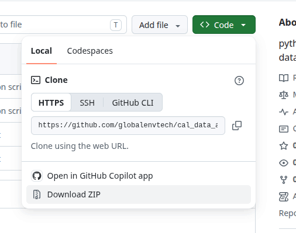
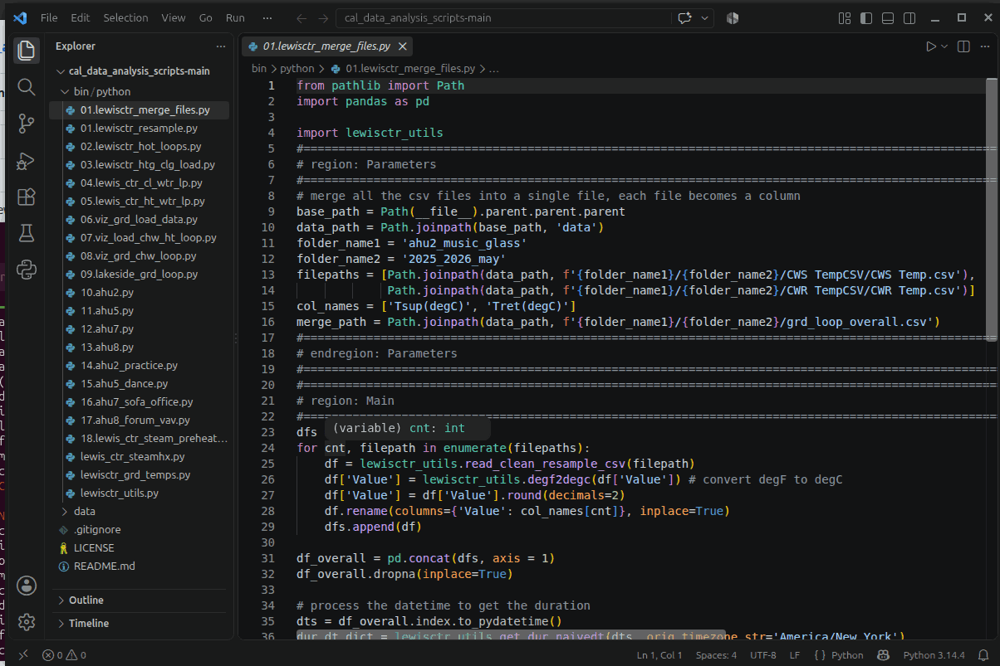
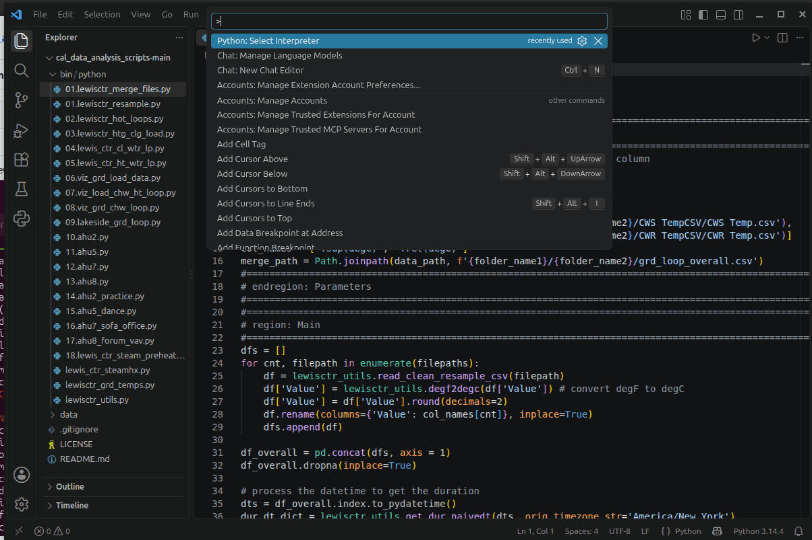

# Getting Started
It is assumed you are familiar with Python. If you do not have an IDE to execute the Python codes. VScode is the recommended IDE. Download it <a href="https://code.visualstudio.com/download?_exp_download=fb315fc982" target="_blank">here</a>. 
 
## Download the scripts and data folder
1. Download the codes from the repository. Go Code -> Download ZIP as shown in the image below. Once downloaded, extract the folder. It will be extracted as 'cal_data_analysis_scripts-main' folder.

    <p align="center">
    
    </p>

2. Now go to our google drive share folder and download the data zip file LCA_CaL/data/lewis_ctr_geodata_20260921.zip. Extract the file. Once extracted, there is a 'data' folder in the 'lewis_ctr_geodata_20260921' folder. 
    ```
    lewis_ctr_geodata_20260921
        |--- data
    ```
3. Cut and paste the 'data' folder into the 'cal_data_analysis_scripts-main' folder. Your 'cal_data_analysis_scripts-main' folder will have the following structure.
    ```
    cal_data_analysis_scripts-main
        |--- bin
            |--- python
        |--- data
        |--- LICENSE
        |--- README.md
    ```

## Create a Python virtual environment to run the script
- this will work for linux and mac computers. Windows computer commands are slightly different.

1. Create a virtual environment call 'lewis_ctr'.
    ```
    python3 -m venv ~/venv/lewis_ctr
    ```
2. Activate the virtual environment.
    ```
    source ~/venv/lewis_ctr/bin/activate
    ```
3. Install the various libraries require for running the scripts.
    ```
    pip install pytz pandas matplotlib geomie3d
    ```

## Run the scripts in VScode
1. Open VScode and go to File -> Open Folder ... select the 'cal_data_analysis_scripts-main' folder.
    
    <p align="center">
    
    </p>

2. Activate the virtual environment that we created in the previous section in the VScode. Using the shortcut key 'Ctrl + Shift + p' you can select the Python:Select Interpreter -> Enter interpreter path...-> Find... Select ~/venv/lewis_ctr/bin/python

    <p align="center">
    
    </p>